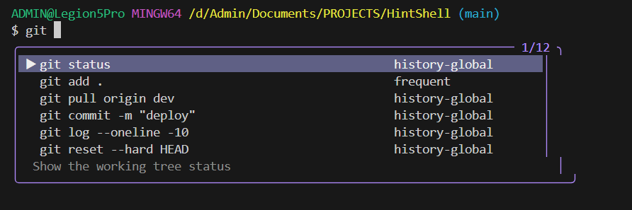
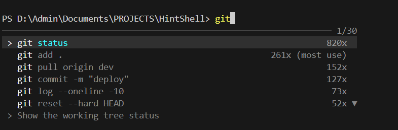
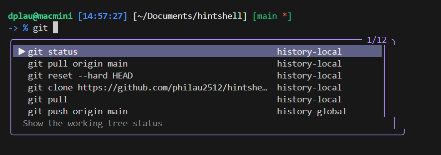
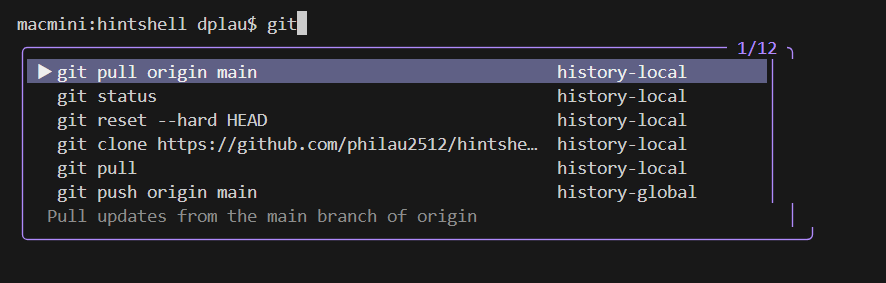

<p align="center">
  
</p>

<h1 align="center">HintShell</h1>
<p align="center"><strong>Local, Context-Aware Real-time Command Suggestions for Your Terminal</strong></p>

<p align="center">
  <a href="https://www.npmjs.com/package/hintshell"></a>
  <a href="https://www.rust-lang.org/"></a>
  <a href="#"></a>
  <a href="#"></a>
  <a href="https://opensource.org/licenses/MIT"></a>
</p>

<p align="center">
  HintShell is a <strong>local command-suggestion engine</strong> that <strong>embeds into your existing shell</strong> (PowerShell, Bash, or Zsh). It combines your command history with bounded context from the current directory and workspace, then presents suggestions without replacing native shell completion. Built with <strong>Rust</strong> for a small, responsive footprint.
</p>

<p align="center">
  
</p>
<p align="center">
  
</p>
<p align="center">
  
</p>
<p align="center">
  
</p>
---

## ⚡ Why HintShell?

Most shells offer basic, single-line autocomplete. HintShell adds a <strong>smart, interactive suggestion panel</strong> while keeping each shell authoritative for its own completion behavior: Bash and PSReadLine still own path and flag completion, and HintShell only supplies advisory command suggestions.

| Feature | HintShell | PowerShell <br>(PSReadLine) | Zsh <br>(zsh-autosuggestions) | Bash | Git Bash | Fish |
|---|:---:|:---:|:---:|:---:|:---:|:---:|
| **Suggestion UI** | Scrollable list | Single inline ghost | Single inline ghost | None | None | Single inline ghost |
| **Prefix matching** | ✅ | ✅ | ✅ | ✅ | ❌ | ✅ |
| **Frequency ranking** | ✅ | ❌ | ❌ | ❌ | ❌ | ✅ |
| **Smart ranking** | ✅ Recent → Default → Most Used → Others | ❌ | ❌ | ❌ | ❌ | ❌ |
| **Command descriptions** | ✅ | ❌ | ❌ | ❌ | ❌ | ❌ |
| **Cross-shell** | ✅ | PowerShell only | Zsh only | Bash only | — | Fish only |
| **Learns from history** | ✅ | ✅ | ✅ | ❌ | ❌ | ✅ |
| **Auto-start daemon** | ✅ | N/A | N/A | N/A | N/A | N/A |
| **600+ built-in commands** | ✅ | ❌ | ❌ | ❌ | ❌ | ❌ |
| **Works with any terminal** | ✅ | ✅ | ✅ | ✅ | ✅ | ✅ |

---

## 🚀 Installation (Recommended)

Follow these steps in order to get HintShell running on your machine.

### 1. Install Dependencies (macOS / Linux / Git Bash)
HintShell uses `fzf` to render the suggestion picker on Bash/Zsh (including **Git Bash** on Windows).
- **macOS**: `brew install fzf`
- **Linux (Ubuntu/Debian)**: `sudo apt install fzf`
- **Windows (Git Bash)**: `winget install junegunn.fzf` (or install fzf another way). PowerShell overlay does **not** require fzf.
- **Windows PowerShell**: No extra dependencies for the real-time overlay.

### 2. Install HintShell
Install via NPM to get the latest pre-built binaries for your platform:
```bash
npm install -g hintshell@latest
```

### 3. Initialize Shell Integration
Run the init command to automatically configure your shell (`.zshrc`, `.bashrc`, or PowerShell profile):
```bash
hs init
```

### 4. Restart Terminal
Restart your terminal or reload your shell config to activate the hooks:
```bash
# Zsh
source ~/.zshrc

# Bash
source ~/.bashrc

# PowerShell
. $PROFILE
```

---

## 📖 Usage

### Git Bash / WSL2 Bash

After `hs init`, opening a normal interactive Git Bash or WSL2 Bash session automatically starts `hintshell bash`, which renders a local live overlay as you type. `fzf` is not required for this live mode.

- **↑ / ↓** navigate HintShell suggestions; **Esc** closes the overlay; **Enter** executes through Bash.
- **Tab** accepts only a compatible command suggestion. Path input such as `cd src/comp`, flags such as `git --ver`, and empty overlays are forwarded to Bash's native completion.
- The overlay adapts near the bottom of the terminal: it shows fewer rows when space is limited and stays hidden when a complete frame would scroll the terminal.
- To bypass the wrapper for one shell, run:

```bash
HINTSHELL_DISABLE_AUTO_BASH=1 bash
```

- Git Bash keeps its existing Windows ConPTY backend. WSL2 uses a separate Unix pseudo-terminal backend and preserves the terminal's current working directory; neither changes PowerShell integration.
- Native Linux Bash retains the existing `Tab`/`fzf` picker instead of starting the live wrapper.
- Set `HINTSHELL_BASH` to an explicit `bash.exe` path on Git Bash. Set `HINTSHELL_DISABLE_LIVE_OVERLAY=1` to reject the wrapper in unsupported terminals.

> **Preview limitation:** the live wrapper requires an ANSI-capable terminal. For full-screen terminal applications, bypass the wrapper and open them from a normal Bash session.

### macOS Bash / Zsh live overlay

On macOS, `hs init` configures the realtime overlay automatically for interactive Bash and Zsh sessions. For Bash login shells, it also adds a managed block to `~/.bash_profile` that loads `~/.bashrc`, so the overlay starts in macOS Terminal and iTerm2 without manual profile edits.

```bash
hs init
```

Open a new terminal after initialization. The wrapper starts the same shell as a child through the Unix pseudo-terminal backend. It preserves the opening directory and synchronizes the current directory after each prompt, so contextual suggestions follow `cd` changes.

- **Tab** keeps native Bash/Zsh path and flag completion authoritative; HintShell accepts only compatible command-prefix suggestions.
- **Bash escape hatch:** `HINTSHELL_DISABLE_AUTO_BASH=1 bash`
- **Zsh escape hatch:** `HINTSHELL_DISABLE_AUTO_ZSH=1 zsh`
- Run `hs uninstall` to remove both the shell hook and the managed Bash login block.
- Use an escape hatch for full-screen terminal applications or any profile whose startup plugins are not compatible with a PTY wrapper.

### Zsh / Bash (macOS/Linux)

**Tab-to-Suggest** uses `fzf` when available. Type `git ` and press **Tab** to open a ranked command picker; **Enter** fills the command line. If `fzf` is unavailable, HintShell uses the top matching command without emitting an executable-path error.

### Context-aware suggestions

Each request includes the current working directory and shell. HintShell merges bounded contextual candidates with local and global history, then ranks the combined list once.

- Paths for supported argument positions, including `cd`, `pushd`, `mkdir`, `rmdir`, `cat`, `rg`, `git add`, and `docker build`.
- Git branches/remotes, npm-family scripts, Docker entities, SSH hosts, and zoxide directories when the command and local runtime are available.
- Local-history matches are boosted only for the active directory; prefix quality remains more important than contextual or fuzzy matches.
- Filesystem scans, workspace detection, and external commands are bounded, cached where appropriate, and fail closed. Context candidates never write themselves to command history.

### PowerShell (Windows/Unix)
**Real-time Overlay**: Suggestions appear automatically as a floating panel beneath your cursor as you type.
- **↑ / ↓** : Navigate
- **Tab** : Accept
- **Esc** : Close

---

## ✨ What's new in 0.3.4

- `hs init` automatically enables the live overlay for macOS Bash and Zsh; no opt-in environment variable is required.
- macOS Bash login sessions load `.bashrc` through a HintShell-managed block in `.bash_profile`, so the overlay works in Terminal and iTerm2.
- `hs uninstall` removes both the shell hook and HintShell's managed Bash login block.
- Git Bash and WSL2 retain their live-overlay backends; Linux Bash/Zsh outside WSL2 continue using Tab/fzf.

## 🔄 Updating

While the daemon is running, Windows locks `hintshell-core.exe`. Use:

```bash
# Recommended
hs update

# Or raw npm — postinstall stops the daemon and runs init
npm i -g hintshell@latest
```

If you still hit a file lock (`os error 32` / "being used by another process"):

```bash
hs stop
# or: taskkill /F /IM hintshell-core.exe
npm i -g hintshell@latest
hintshell init
```

## 🗑️ Uninstallation

If you need to remove HintShell, it now comes with a clean uninstaller that handles everything for you:

```bash
# 1. Run the official uninstaller
hs uninstall

# 2. (Optional) Remove the NPM package
npm uninstall -g hintshell
```
*Note: `hs uninstall` stops the daemon, removes hook lines from your shell configs, and deletes binaries from `~/.hintshell/bin`, but keeps your history database (`history.db`) safe.*

---

## 🏗️ CLI Reference

```bash
hs status      # Check if the daemon is running and see stats
hs start       # Manually start the daemon
hs stop        # Stop the daemon
hs update      # Stop daemon, npm install -g, init, restart
hs uninstall   # Completely remove shell integration and binaries
```

---

## 🏗️ Architecture

HintShell is a **client-daemon** system. It does **not** replace your terminal or shell. It plugs in via a thin hook.

```
┌─────────────────────────────────┐
│  Your Terminal                  │
│  (Windows Terminal, iTerm2,     │
│   Alacritty, any terminal)      │
│                                 │
│  ┌───────────────────────────┐  │
│  │  Your Shell               │  │
│  │  (PowerShell / Bash / Zsh)│  │
│  │       ▲                   │  │
│  │       │ hook / module     │  │
│  │       ▼                   │  │
│  │  ┌─────────┐    IPC    ┌──────────────┐
│  │  │   hs    │◄─────────►│ hintshell    │
│  │  │  (CLI)  │ Named Pipe│ -core        │
│  │  └─────────┘  or UDS   │ (Daemon)     │
│  │                        │ SQLite+Fuzzy │
│  │                        └──────────────┘
│  └───────────────────────────┘  │
└─────────────────────────────────┘
```

---

## 🤝 Contributing & License

Contributions are welcome! Built with 🦀 Rust for speed and safety. 
Licensed under **MIT**.

<p align="left">
  <strong>Stop memorizing commands. Let HintShell remember for you.</strong>
</p>
